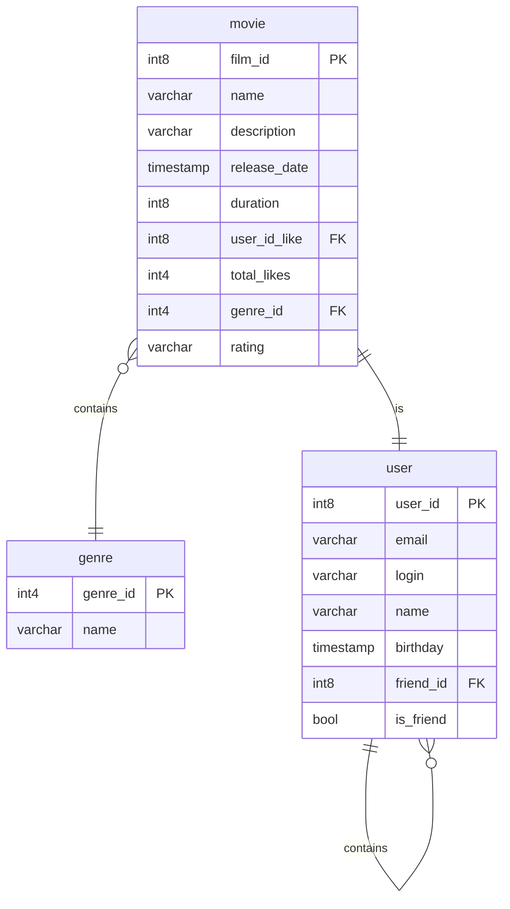

# java-filmorate
Template repository for Filmorate project.

# Модель базы данных
[Посмотреть детально диаграмму](https://dbdiagram.io/d/Filmorate-66939c0a9939893daedf2e4d)

```Для локального отображения схемы необходимо установить плагин Mermaid```

1. У таблицы ```movie``` связь в таблицей ```user``` по параметру ```user_id_like``` 
при добавлении лайка фильму пользователем сам пользователь линкуется с фильмом
2. У таблицы ```movie``` связь с таблицей ```genre``` по параметру ```genre_id```
при добавлении фильма, проставлется в таблицу идентификатор жанра, отдельная таблица жанров нужна для разрешения 
аномалий данных
3. У таблицы ```user``` есть связь с самой с собой по параметру ```friend_id```
при добавлении нового друга его идентификатор добавляется пользователю и в случае 
одобрения заявки на друзья - меняется признак ```is_friend```



# Примеры запроса:
### 1. Выведем 10 популярных фильмов с отображением жанра и пользователей, кто поставил лайк
```
SELECT *
FROM movie AS mv
LEFT JOIN genre AS gn ON mv.genre_id=gn.genre_id
LEFT JOIN user AS us ON mv.user_id_like=us.user_id
ORDER BY mv.total_likes DESC
LIMIT 10;
```

### 2. Выведем список друзей пользователя
```
SELECT us.user_id, fr.user.id
FROM user AS us
JOIN user AS fr ON us.user_id=fr.friend_id
```