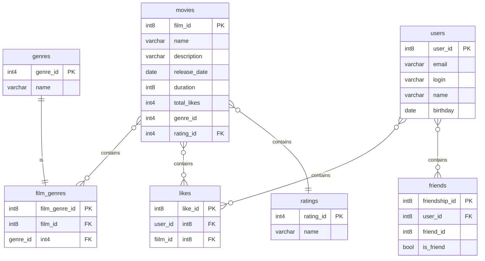

# java-filmorate
Template repository for Filmorate project.

# Модель базы данных
[Посмотреть детально диаграмму](https://dbdiagram.io/d/Filmorate-66939c0a9939893daedf2e4d)

```Для локального отображения схемы необходимо установить плагин Mermaid```



# Примеры запроса:
### 1. Выведем 10 популярных фильмов с отображением жанра, рейтинга и пользователей, кто поставил лайк
```
SELECT mv.name, mv.total_likes, g.name as genre_name, usr.login as user_login
FROM movies AS mv
LEFT JOIN film_genres AS fg ON mv.film_id=fg.film_id
LEFT JOIN genres AS g ON fg.genre_id=g.genre_id
LEFT JOIN ratings AS r ON mv.rating_id=r.rating_id
LEFT JOIN likes AS l ON mv.film_id=l.film_id
LEFT JOIN users AS usr ON l.user_id=usr.user_id
ORDER BY mv.total_likes DESC
LIMIT 10;
```

### 2. Выведем список друзей пользователя
```
SELECT usr.user_id, fr.user.id
FROM user AS usr
LEFT JOIN friends AS fr ON us.user_id=fr.user_id
```