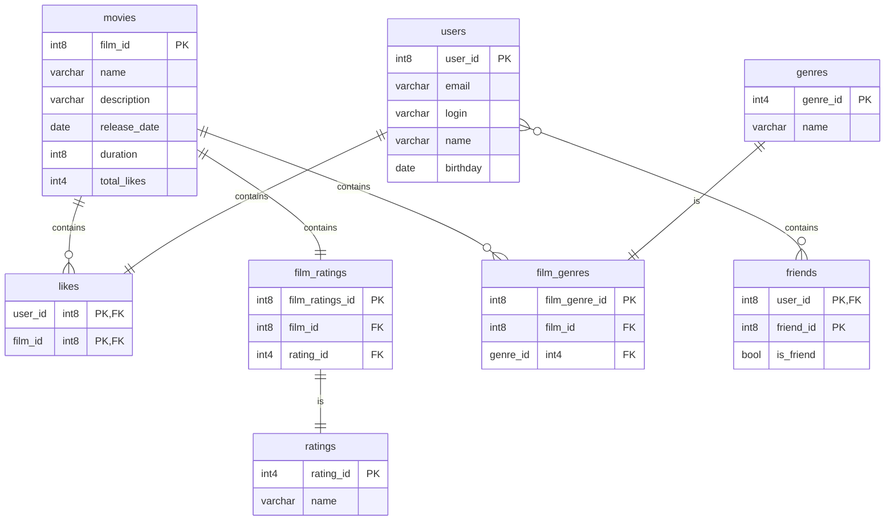

# java-filmorate
Template repository for Filmorate project.

# Модель базы данных
[Посмотреть детально диаграмму](https://dbdiagram.io/d/Filmorate-66939c0a9939893daedf2e4d)

```Для локального отображения схемы необходимо установить плагин Mermaid```

